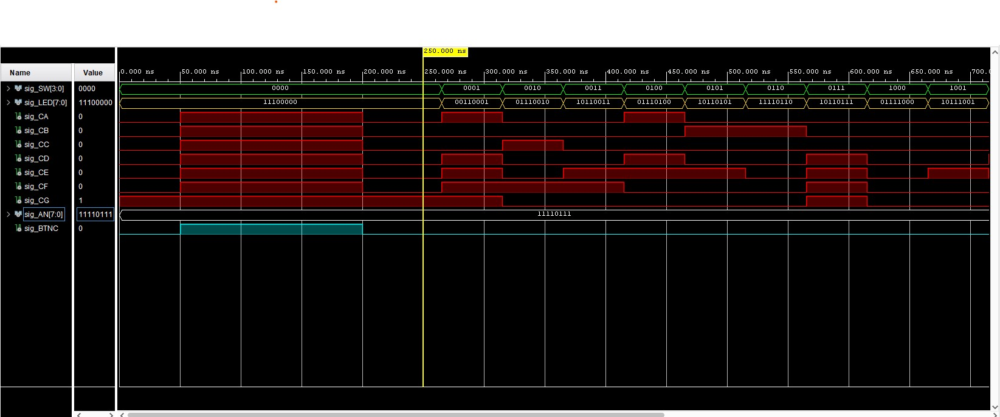
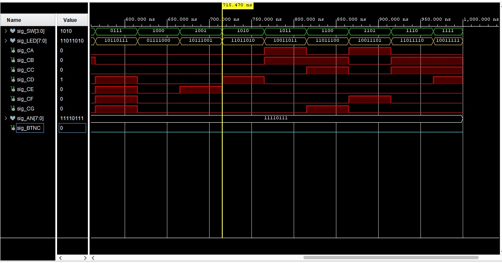

## Pre-Lab preparation

The Nexys A7 board provides two four-digit common anode seven-segment LED displays (configured to behave like a single eight-digit display).

2. Complete the decoder truth table for **common anode** 7-segment display.

   | **Symbol** | **Inputs** | **a** | **b** | **c** | **d** | **e** | **f** | **g** |
   | :-: | :-: | :-: | :-: | :-: | :-: | :-: | :-: | :-: |
   | 0 | 0000 | 0 | 0 | 0 | 0 | 0 | 0 | 1 |
   | 1 | 0001 | 1 | 0 | 0 | 1 | 1 | 1 | 1 |
   | 2 | 0010 | 0 | 0 | 1 | 0 | 0 | 1 | 0 |
   | 3 | 0011 | 0 | 0 | 0 | 0 | 1 | 1 | 0 |
   | 4 | 0100 | 1 | 0 | 0 | 1 | 1 | 0 | 0 |
   | 5 | 0101 | 0 | 1 | 0 | 0 | 1 | 0 | 0 |
   | 6 | 0110 | 0 | 1 | 0 | 0 | 0 | 0 | 0 |
   | 7 | 0111 | 0 | 0 | 0 | 1 | 1 | 1 | 1 |
   | 8 | 1000 | 0 | 0 | 0 | 0 | 0 | 0 | 0 |
   | 9 | 1001 | 0 | 0 | 0 | 0 | 1 | 0 | 0 |
   | A | 1010 | 0 | 0 | 0 | 1 | 0 | 0 | 0 |
   | b | 1011 | 1 | 1 | 0 | 0 | 0 | 0 | 0 |
   | C | 1100 | 0 | 1 | 1 | 0 | 0 | 0 | 1 |
   | d | 1101 | 1 | 0 | 0 | 0 | 0 | 1 | 0 |
   | E | 1110 | 0 | 1 | 1 | 0 | 0 | 0 | 0 |
   | F | 1111 | 0 | 1 | 1 | 1 | 0 | 0 | 0 |

### LED(7:4) indicators

1. Complete the truth table for LEDs(7:4) according to comments in source code.

   | **Hex** | **Inputs** | **LED4** | **LED5** | **LED6** | **LED7** |
   | :-: | :-: | :-: | :-: | :-: | :-: |
   | 0 | 0000 | 0 | 1 | 1 | 1 |
   | 1 | 0001 | 1 | 1 | 0 | 0 |
   | 2 | 0010 | 1 | 1 | 1 | 0 |
   | 3 | 0011 | 1 | 1 | 0 | 1 |
   | 4 | 0100 | 1 | 1 | 1 | 0 |
   | 5 | 0101 | 1 | 1 | 0 | 1 |
   | 6 | 0110 | 1 | 1 | 1 | 1 |
   | 7 | 0111 | 1 | 1 | 0 | 1 |
   | 8 | 1000 | 1 | 1 | 1 | 0 |
   | 9 | 1001 | 1 | 1 | 0 | 1 |
   | A | 1010 | 1 | 0 | 1 | 1 |
   | b | 1011 | 1 | 0 | 0 | 1 |
   | C | 1100 | 1 | 0 | 1 | 1 |
   | d | 1101 | 1 | 0 | 0 | 1 |
   | E | 1110 | 1 | 0 | 1 | 1 |
   | F | 1111 | 1 | 0 | 0 | 1 |

2. Listing of LEDs(7:4) part of VHDL architecture from source file `top.vhd`. Try to write logic functions as simple as possible. Always use syntax highlighting, meaningful comments, and follow VHDL guidelines:

   ```vhdl
     --------------------------------------------------------------------
   -- Experiments on your own: LED(7:4) indicators

   -- Turn LED(4) on if input value is equal to 0, ie "0000"
    LED(4) <= '0' when (SW = "0000") else
              '1';

   -- Turn LED(5) on if input value is greater than "1001", ie 10, 11, 12, ...
    LED(5) <= '0' when (SW > "1001") else
              '1';

   -- Turn LED(6) on if input value is odd, ie 1, 3, 5, ...
    LED(6) <=  '0' when (SW(0) = '1') else
               '1';

   --            '0' when (SW = "0001") else 
   --            '0' when (SW = "0011") else 
   --            '0' when (SW = "0101") else 
   --            '0' when (SW = "0111") else 
   --            '0' when (SW = "1001") else 
   --            '0' when (SW = "1011") else 
   --            '0' when (SW = "1101") else 
   --            '0' when (SW = "1111") else
   --            '1';

   -- Turn LED(7) on if input value is a power of two, ie 1, 2, 4, or 8
    LED(7) <=  --'0' when (SW = "0001") else
               --'0' when (SW = "0010") else
               --'0' when (SW = "0100") else
               --'0' when (SW = "1000") else

               --in one go
               '0' when (SW = "0001" or SW = "0010" or SW = "0100" or SW = "1000") else

               -- Just trying
               --'0' when ((SW(0) XOR SW(1) XOR SW(2) XOR SW(3)) = '1' and SW /= "0111" and SW < "1001") else

               '1';
   ```

3. Screenshot with simulated time waveforms for LED(7:4). Always display all inputs and outputs (display the inputs at the top of the image, the outputs below them) at the appropriate time scale!

   
   
4. Rest of simulation

   
